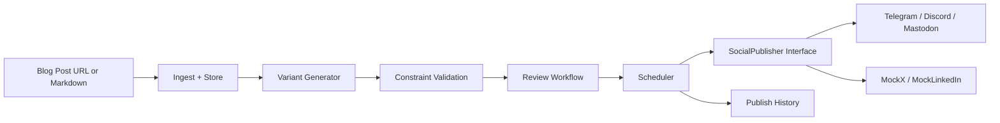

# Social Media Studio

A FastAPI-based backend for generating, validating, reviewing, scheduling, and publishing social content.

## Quick start

```powershell
docker compose up --build
```

Then open:

- API: http://localhost:8000/docs
- Postgres: localhost:5432
- Redis: localhost:6379

## Environment

Copy `.env.example` to `.env` and adjust values if needed.

## Architecture



## Features

- URL or Markdown ingestion
- Platform-specific variant generation
- Constraint validation
- Review workflow with draft/approved/rejected/published lifecycle
- Durable scheduler
- Adapter-based publishing
- Idempotent publish history
